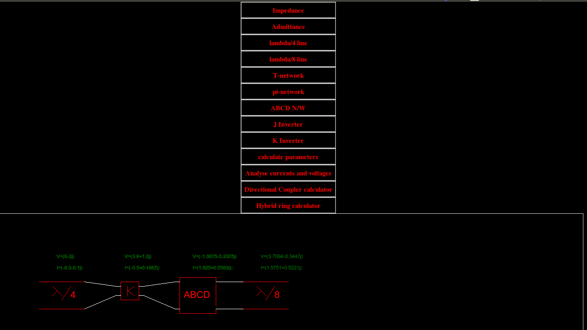
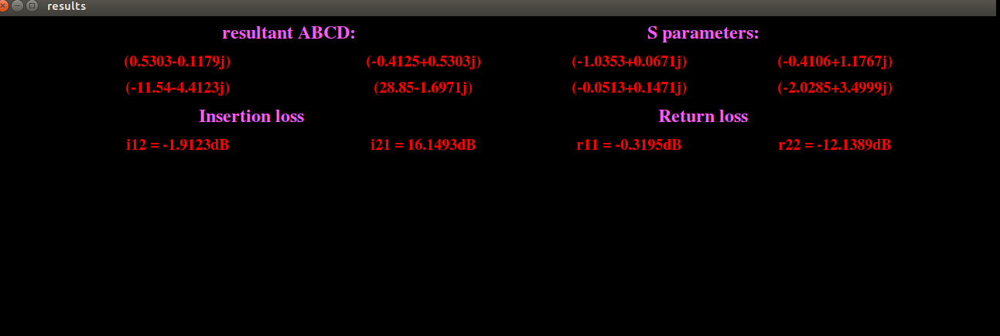

# microwave_guitool
Developed this tool in python to help beginners understand how various microwave components look , it also helps design a network and calculate its parameters

# Requirements
 1. Python 2.7 : Libraries: Tkinter, turtle, numpy
 2. OS: Windows/Linux

# Usage
1. Clone the repo
2. cd microwave_guitool
3. python2 micro-final2.py
4. Use GUI to select components and add them to the circuit
5. Use calculator and analyser buttons to get stats

# Screenshots:
## Circuit Construction

## Circuit Results

